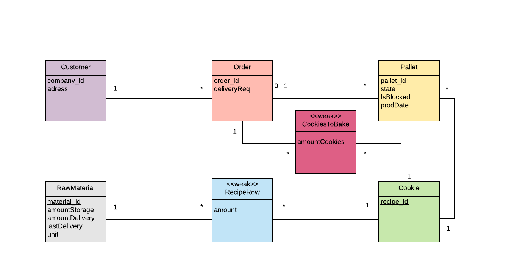

# EDAF75, project report

This is the report for

 + Alice-Mariam Ansari, `dic12aan`
 + Mohammad Abo Al Anein, `mo3541ab-s`
 + Anas Mofleh, `an0374mo-s` 

We solved this project on our own, except for:

 + The Peer-review meeting
 + Guidance from our supervisor Christian Söderberg


## ER-design

The model is in the file [`uml.png`](uml.png):

<center>
    
</center>

## Relations

The ER-model above gives the following relations (neither
[Markdown](https://docs.gitlab.com/ee/user/markdown.html)
nor [HTML5](https://en.wikipedia.org/wiki/HTML5) handles
underlining withtout resorting to
[CSS](https://en.wikipedia.org/wiki/Cascading_Style_Sheets),
so we use bold face for primary keys, italicized face for
foreign keys, and bold italicized face for attributes which
are both primary keys and foreign keys):

+ customers(**company_id**, adress)
+ orders(**o_id**, order_id, deliveryReq, _company_id_)
+ rawMaterials(**material_id**, amountStorage, amountDelivery, lastDelivery, unit)
+ recipeRow(amount, _material_id_, _recipe_id_)
+ cookies(**recipe_id**)
+ pallets(**pallet_id**, state, isBlocked, prodDate, _order_id_, _recipe_id_)
+ cookiesToBake(amountCookies, _o_id_, _recipe_id_)

## Scripts to set up database

The scripts used to set up and populate the database are in:

 + [`tables.sql`](tables.sql) defines the tables, and inserts data.

So, to create and initialize the database, we run:

```shell
sqlite3 dataBas.db < tables.sql
```

## How to compile and run the program

**1. Using command line:**
```shell
gradlew.bat run
```

**or**

```shell
javac -d bin/ -cp src src/main/java/students/App.java
java -cp bin:sqlite-jdbc.jar App.Main
```

**2. Using IDE:** 


Import the the project as a gradle project, let gradle fix the depencis for you by running its Tasks, 
to be more detailed run "build setup" in the gradle tasks.

Finally, run the main method in App class. 


## How to use the program: 
After running the program you need a second terminal, where you paste the following command:

**1. Empty the database and reset it back to its initial values:**
```shell
curl -X POST http://localhost:8888/reset 
```

**2. Return all customers:**
```shell
curl -X GET http://localhost:8888/customers
```

**3. Shows the inventory:**
```shell
curl -X GET http://localhost:8888/ingredients
```

**4. Shows the names of our cookies, ordered alphabetically**
```shell
curl -X GET http://localhost:8888/cookies
```

**5. Shows the recipes, ordered by cookie name and ingredients:**
```shell
curl -X GET http://localhost:8888/recipes
```

**6. Tries to create a new pallet with a given cookie:**

where you could replace "Berliner" with one of these cookies:

* *Nut ring.*
* *Nut cookie.*
* *Amneris.*
* *Tango.*
* *Almond delight.*
* *Berliner.*


```shell
curl -X POST http://localhost:8888/pallets\?cookie\=Berliner
```


**7. Gives a list of all pallets in the storeroom :**
```shell
curl -X GET http://localhost:8888/pallets

```

**8. Gives a list of specified pallets in the storeroom, using the following parameters:**


*  **after:**     get pallets produced after the given date.
*  **before:**    get pallets produced before the given date.
*  **cookie:**    get pallets with the given cookie.
*  **blocked:**   get pallets which are blocked or non-blocked, 
           where 0 means non-blocked and 1 means blocked. 

For exemple, if you want To get all non-blocked pallets of “Berliner” produced after 2020-03-03,
we enter:
```shell
curl -X GET http://localhost:8888/pallets\?cookie\=Berliner\&blocked\=0\&after\=2020-03-03
```


**9. block or unblock pallets for a chosen cookie produced on a specific date:**
```shell
curl -X POST http://localhost:8888/block/Tango/2020-05-05/2020-05-05

curl -X POST http://localhost:8888/unblock/Tango/2020-05-05/2020-05-05
```


